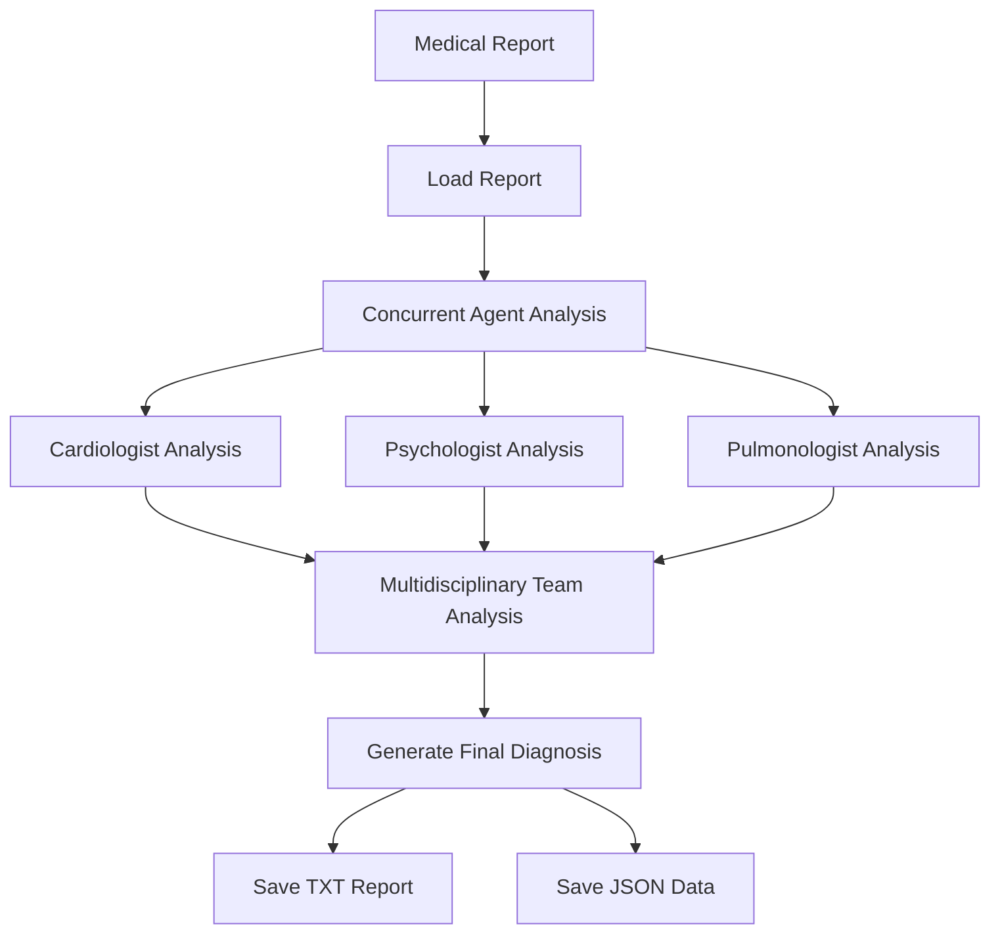

# Medical Report Analysis System 🏥

An intelligent system that analyzes medical reports using multiple AI models through specialized medical agents (Cardiologist, Psychologist, Pulmonologist) and provides a comprehensive multidisciplinary assessment.

## 🌟 Features

- Multi-agent medical analysis system
- Support for multiple AI providers (Google Gemini, Anthropic Claude, OpenAI)
- Concurrent processing of specialist assessments
- Comprehensive multidisciplinary team analysis
- Detailed logging and error handling
- Results export in both TXT and JSON formats

## 🔄 Process Flow

<div align="center">
  
</div>




## 🚀 Setup

### Prerequisites

- Python 3.8+
- pip (Python package manager)

### Directory Structure

```
medical-analysis/
├── Medical_Reports/
│   └── Disorder.txt
├── Utils/
│   └── Agents.py
├── results/
├── .env
├── main.py
└── requirements.txt
```

### Installation

1. Clone the repository:
```bash
git clone https://github.com/TheVinaySagar/AI-Agents-Medical-Diagnostics.git
cd AI-Agents-Medical-Diagnostics
```

2. Create and activate a virtual environment:
```bash
# Windows
python -m venv venv
venv\Scripts\activate

# macOS/Linux
python3 -m venv venv
source venv/bin/activate
```

3. Install required packages:
```bash
pip install -r requirements.txt
```

### Environment Setup

1. Create a `.env` file in the project root:
```env
# Choose at least one of these API keys based on your preferred provider
GOOGLE_API_KEY=your_gemini_api_key
ANTHROPIC_API_KEY=your_anthropic_api_key
OPENAI_API_KEY=your_openai_api_key
```

2. Get your API keys:
- Google Gemini API key: [Google AI Studio](https://makersuite.google.com/app/apikey)
- Anthropic API key: [Anthropic Console](https://console.anthropic.com/)
- OpenAI API key: [OpenAI Platform](https://platform.openai.com/api-keys)

## 📋 Usage

1. Place your medical report in the `Medical_Reports` directory:
```bash
cp your_report.txt Medical_Reports/Disorder.txt
```

2. Run the analysis:
```bash
python main.py
```

3. Find results in the `Results` directory:
- `final_diagnosis-Patient-details.txt`: Comprehensive diagnosis
- `all_responses.json`: Detailed responses from recent agents

## 🛠️ Configuration

### Changing AI Provider

Modify the provider in `main.py`:
```python
analyzer = MedicalAnalyzer(
            medical_report_path,
            provider="gemini"  # or "anthropic" or "openai"
        )
```

### Rate Limits

Different providers have different rate limits:
- Gemini Pro: 60 requests/minute (free tier)
- Claude 3 Haiku: Varies by account type
- GPT-3.5/4: Varies by account type

## 📦 Dependencies

- langchain-core
- langchain-google-genai
- langchain-anthropic
- langchain-openai
- python-dotenv
- concurrent.futures (standard library)

## 📊 Output Format

### Final Diagnosis (TXT)
```
### Final Diagnosis:

[Detailed diagnosis text here]
```

### All Responses (JSON)
```json
{
    "Cardiologist": "[Cardiologist's analysis]",
    "Psychologist": "[Psychologist's analysis]",
    "Pulmonologist": "[Pulmonologist's analysis]",
    "Final_Diagnosis": "[Comprehensive team analysis]"
}
```

## 🛡️ Error Handling

The system includes comprehensive error handling for:
- File operations
- API calls
- Agent processing
- Results saving

Errors are logged to the console with detailed information for debugging.

## 🤝 Contributing

1. Fork the repository
2. Create a feature branch
3. Commit your changes
4. Push to the branch
5. Create a Pull Request

## 📝 License

This project is licensed under the MIT License - see the LICENSE.md file for details.

## 🙏 Acknowledgments

- LangChain for the chat model interfaces
- Google, Anthropic, and OpenAI for their AI models
- Contributors and maintainers
